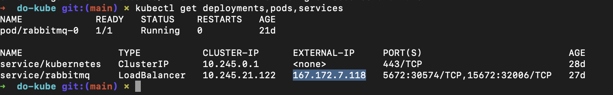
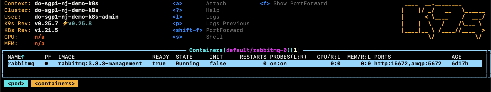
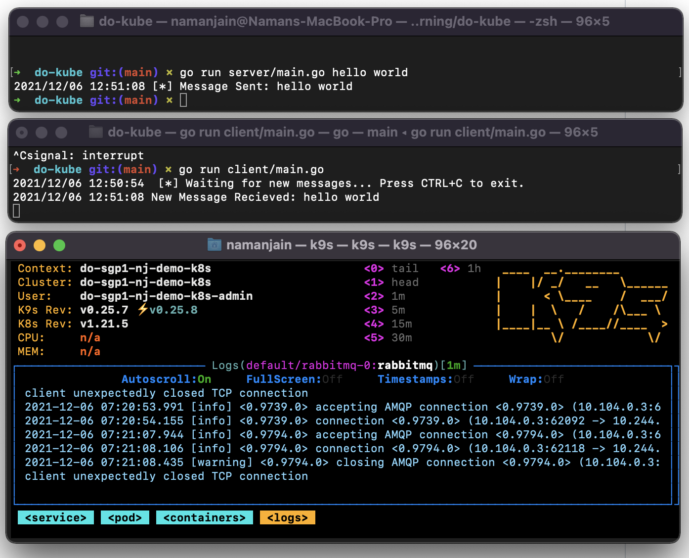

# Digital Ocean - Kubernetes Challenge

[Challenge Link](https://www.digitalocean.com/community/pages/kubernetes-challenge)

### Problem Statement

- Deploy a scalable message queue :- A critical component of all the scalable architectures are message queues used to store and distribute messages to multiple parties and introduce buffering. For this project, use a sample app to demonstrate how your message queue works. 

### Solution Implemented 

- RabbitMQ service deployed on DO Kubernetes.
- Loadbalancer service exposed to communicate with RabbitMQ service.
- Simple client - server communication scripts to interact over a RabbitMQ messaging queue.

### Steps 

1. Create a managed kubernetes cluster on Digital Ocean and connect to it via the config file or doctl cli.
2. Clone the repository and cd into the clonned folder.
3. Deploy the RabbitMQ Service.
```
kubectl apply --filename k8s/RabbitMQStatefulSet.yml
```
4. Deploy a loadbalancer in front of the RabbitMQ Service.
```
kubectl apply --filename k8s/LBService.yml
```
5. Get the external IP to access the RabbitMQ
```
kubectl get deployments,pods,services
```

Capture the EXTERNAL-IP of the LoadBalancer Service.

By default the username and password for RabbitMQ dashboard is guest and guest.
The running messaging queue on kubernetes can be accessed on http://167.172.7.118:15672 and the amqp on amqp://167.172.7.118:5672






### Using Client - Server Scripts
The sample scripts show how a client can send a message to a running server.
1. Open a terminal window and cd into the project folder.
2. Start the server by running `go run server/main.go` - this will start listening to new messages through a defined queue in RabbitMQ
3. Open another terminal window and cd into the project folder. 
4. Run the client by running `go run client/main.go <any message>`. - this will send the message to server over the defined queue in RabbitMQ



### References 
- TGI RabbitMQ by RabbitMQ - https://www.youtube.com/playlist?list=PLfX-LA-Cf6rE16woOuRmi3goM_K8PUAhQ